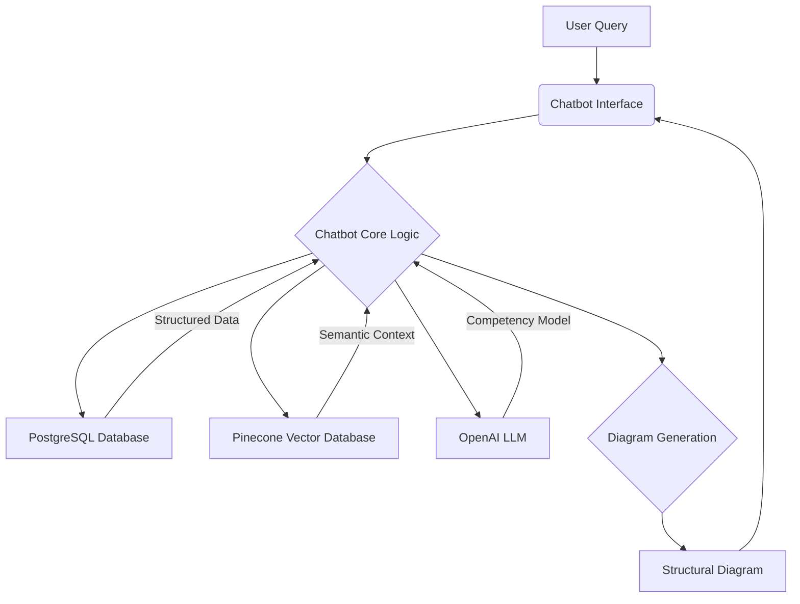

# Competency Model Chatbot: System Architecture and Data Flow Design

## 1. Introduction

This document outlines the system architecture and data flow for the proposed competency model chatbot. The chatbot aims to provide structural diagrams for job roles by leveraging a vast database of occupation details, skills, knowledge, and experience. The core of the system will be built upon a Hybrid Retrieval-Augmented Generation (RAG) approach, integrating a relational database (PostgreSQL) for structured data, a vector database (Pinecone) for semantic search, and a Large Language Model (LLM) from OpenAI for generating competency models and chatbot responses.

## 2. System Architecture Overview

The system will consist of several interconnected components, each responsible for a specific part of the data processing, storage, and retrieval pipeline. The high-level architecture is depicted below:

**Components:**

*   **User Query:** The input from the user, typically a job role for which a competency model is requested.
*   **Chatbot Interface:** The front-end application where users interact with the system. This could be a web-based interface or a command-line interface initially.
*   **Chatbot Core Logic:** The central processing unit of the chatbot, responsible for orchestrating data retrieval, LLM interaction, and response generation.
*   **PostgreSQL Database:** A relational database used to store structured data from the `OccupationData.xlsx` and `Skills.xlsx` files. It will serve as the primary data store for precise, attribute-based queries.
*   **Pinecone Vector Database:** A specialized database for storing high-dimensional vector embeddings of textual data. It will enable semantic search capabilities, allowing the system to find contextually relevant information even if exact keywords are not present.
*   **OpenAI LLM:** A Large Language Model (e.g., GPT-4) used for understanding natural language queries, generating competency models based on retrieved information, and formulating coherent responses.
*   **Diagram Generation:** A module responsible for converting the structured competency model (e.g., a pandas DataFrame) into visual representations, such as tabular diagrams (HTML tables) or structural graphs (using Graphviz).
*   **Structural Diagram:** The final output presented to the user, visualizing the competency model for the requested job role.

## 3. Data Flow and Processing Pipeline

The data flow within the system can be broken down into several distinct phases, from initial data ingestion to final diagram generation:

### 3.1. Data Ingestion and ETL (Extract, Transform, Load)

**Source Data:**

*   `OccupationData.xlsx`: Contains `O*NET-SOC Code`, `Title`, and `Description` for various job roles.
*   `Skills.xlsx`: Contains `O*NET-SOC Code`, `Title`, `Element ID`, `Element Name`, `Scale ID`, `Scale Name`, `Data Value`, `N`, `Standard Error`, `Lower CI Bound`, `Upper CI Bound`, `Recommend Suppress`, `Not Relevant`, and `Date`, `Domain Source` related to skills and abilities for different job roles.

**Process:**

1.  **Extraction:** Data will be extracted from the provided Excel files (`OccupationData.xlsx` and `Skills.xlsx`) using `pandas` and `openpyxl`.
2.  **Transformation:**
    *   Column names will be cleaned (e.g., stripping whitespace, replacing special characters, converting to lowercase).
    *   Duplicate rows will be handled (e.g., `onet_soc_code` in `OccupationData.xlsx`, and overall duplicates in `Skills.xlsx`).
    *   Missing values will be addressed (e.g., filling `description` in `OccupationData.xlsx` and `not_relevant` in `Skills.xlsx`).
    *   Data types will be coerced (e.g., `data_value` to numeric).
    *   The two datasets will be joined on a common key, `O*NET-SOC Code` (which will be transformed to `onet_soc_code`), to create a unified view of job competencies.
3.  **Loading:** The transformed and unified data will be loaded into a PostgreSQL database table named `job_competencies`. This table will serve as the primary structured data store.

**Tools:** Python (pandas, sqlalchemy, psycopg2-binary).

### 3.2. Embedding Generation and Vector Database Interaction

**Purpose:** To convert textual data into numerical vector embeddings for efficient semantic search and to store these embeddings in a vector database.

**Process:**

1.  **Data Fetching:** Relevant text data (e.g., `title`, `description`, `element_name`, `scale_name`) will be fetched from the `job_competencies` table in PostgreSQL.
2.  **Text Combination:** A combined text string (`full_text`) will be created for each record by concatenating relevant textual fields. This `full_text` will be used for embedding generation.
3.  **Embedding Generation:** The combined text strings will be sent to the OpenAI Embeddings API (`text-embedding-ada-002`) to generate high-dimensional vector representations. Batch processing will be implemented to optimize API calls and manage rate limits.
4.  **Vector Upsertion:** The generated embeddings, along with their original text and metadata (e.g., `onet_soc_code`, `title`, `description`, `element_name`, `scale_name`, `full_text`), will be upserted into a Pinecone vector index named `competency-model-index`. The index will be created if it doesn't already exist, with appropriate dimensions and similarity metrics (e.g., cosine similarity).

**Tools:** Python (pandas, sqlalchemy, openai, pinecone-client).

### 3.3. LLM Interaction and Response Parsing (Chatbot Core Logic)

**Purpose:** To process user queries, retrieve relevant information from both structured and vector databases, interact with the LLM, and parse its responses.

**Process:**

1.  **User Query Reception:** The chatbot will receive a job role query from the user.
2.  **Data Retrieval (Hybrid Approach):**
    *   **Structured Data Retrieval (PostgreSQL):** The system will first attempt to find an exact or near-exact match for the job role in the PostgreSQL `job_competencies` table. If found, it will retrieve the `onet_soc_code`, `title`, `description`, and all associated skills/competencies (element name, scale name, data value) for that job role.
    *   **Semantic Search Retrieval (Pinecone):** The user's query will be converted into an embedding using the OpenAI Embeddings API. This embedding will then be used to query the Pinecone index for semantically similar job roles or competencies. This step provides additional contextual information, especially for queries that don't have direct matches in the structured database.
3.  **Prompt Construction:** The retrieved structured data and semantic context will be combined to construct a comprehensive prompt for the OpenAI LLM. The prompt will instruct the LLM to generate a detailed competency model for the specified job role in a structured format (e.g., a Markdown table).
4.  **LLM Call:** The constructed prompt will be sent to the OpenAI Chat Completions API (e.g., using `gpt-4`).
5.  **Response Parsing:** The LLM's response, which is expected to be a Markdown table, will be parsed into a structured format, such as a pandas DataFrame. This DataFrame will contain columns like `Competency Area`, `Skill/Knowledge/Ability`, `Importance (1-5)`, `Level (1-5)`, and `Description`.

**Tools:** Python (pandas, sqlalchemy, openai, pinecone-client).

### 3.4. Diagram Rendering

**Purpose:** To visualize the generated competency model in both tabular and graphical formats.

**Process:**

1.  **Tabular Diagram Rendering:** The parsed pandas DataFrame representing the competency model will be converted into an HTML table for web display or kept as Markdown for textual output. This provides a clear, structured overview of the competencies.
2.  **Visual Graph Rendering:**
    *   The pandas DataFrame will be used to generate a DOT language string, which is a graph description language. This string will define nodes for the job role, competency areas, and individual skills/knowledge/abilities, along with edges representing their relationships.
    *   Graphviz, an open-source graph visualization software, will be used to render the DOT string into an image format (e.g., PNG, SVG). This will provide a visual structural diagram of the competency model.

**Tools:** Python (pandas, graphviz library), Graphviz system-wide installation.

## 4. Environment Setup and Dependencies

To set up the development environment, the following steps and dependencies are required:

*   **Python:** Version 3.x or higher.
*   **Virtual Environment:** Highly recommended for managing project dependencies.
*   **Python Libraries:**
    *   `pandas`: For data manipulation and analysis.
    *   `openpyxl`: For reading Excel files.
    *   `psycopg2-binary`: For connecting to PostgreSQL.
    *   `openai`: Official Python client for OpenAI API.
    *   `pinecone-client`: Client for Pinecone vector database.
    *   `python-dotenv`: For managing environment variables.
    *   `sqlalchemy`: For interacting with databases.
    *   `graphviz`: Python library for Graphviz.
*   **External Software:**
    *   **PostgreSQL:** A running instance of PostgreSQL database.
    *   **Graphviz:** System-wide installation for rendering visual graphs.
*   **.env File:** A `.env` file will be used to securely store API keys (OpenAI, Pinecone) and database credentials (PostgreSQL connection string).

## 5. Future Enhancements (Out of Scope for Initial Implementation)

*   **User Authentication and Authorization:** Implementing secure access for different user roles.
*   **Advanced Chatbot Features:** Adding conversational memory, multi-turn interactions, and more sophisticated natural language understanding.
*   **Customizable Diagram Styles:** Allowing users to select different visual styles for the structural diagrams.
*   **Web Interface Deployment:** Deploying the chatbot interface as a full-fledged web application.
*   **Monitoring and Logging:** Implementing robust logging and monitoring for system performance and error tracking.
*   **Scalability:** Designing for horizontal scalability to handle increased data volume and user traffic.

This design document provides a solid foundation for developing the competency model chatbot. The next steps will involve implementing each phase, starting with the data ingestion and ETL process.

## 6. Database Rationale: PostgreSQL vs. Pinecone

### 6.1. Why Two Databases?

The decision to use both a traditional relational database (PostgreSQL) and a vector database (Pinecone) stems from the distinct types of data and access patterns required for a robust Hybrid RAG system. Each database serves a unique and complementary purpose:

*   **PostgreSQL (Relational Database):**
    *   **Structured Data Storage:** PostgreSQL is ideal for storing highly structured, tabular data, such as the `occupation details` and `skills` data. This includes job codes, titles, descriptions, element names, scale names, and numerical data values. It excels at maintaining data integrity, enforcing relationships between tables, and performing complex joins and aggregations.
    *   **Exact Match and Attribute-Based Queries:** When you need to retrieve specific records based on exact matches (e.g., finding all skills for a particular `O*NET-SOC Code`) or filter data based on attributes (e.g., `data_value` ranges), PostgreSQL provides efficient and reliable querying capabilities. This is crucial for retrieving precise, factual information about job roles and their associated competencies.
    *   **Data Management:** It offers robust features for data management, including transactions, backups, and user permissions, which are essential for maintaining a large and critical dataset.

*   **Pinecone (Vector Database):**
    *   **Semantic Search and Similarity:** Pinecone is specifically designed to store and query high-dimensional vector embeddings. These embeddings capture the semantic meaning of text, allowing for 

semantic search. This means you can query the database with a natural language phrase (e.g., "skills for a creative director") and retrieve job roles or competencies that are semantically similar, even if the exact words aren't present. This is invaluable for the RAG approach, as it allows the chatbot to retrieve contextually relevant information beyond simple keyword matching.
    *   **Scalability for Embeddings:** Vector databases are optimized for handling large volumes of vector data and performing fast similarity searches across millions or billions of vectors. This is crucial given the potential size of your `skills.xlsx` data (60k+ rows, which will generate a significant number of embeddings).
    *   **Complementary to Relational Data:** In a Hybrid RAG system, the vector database complements the relational database by providing a layer of semantic understanding. Structured queries to PostgreSQL retrieve precise data, while semantic queries to Pinecone enrich the context with broader, contextually relevant information. The LLM then synthesizes information from both sources to generate a comprehensive and accurate response.

### 6.2. Pinecone Free Tier Sufficiency

Pinecone offers a free tier that provides a certain amount of storage and query capacity. For your `skills.xlsx` dataset with 60k+ rows, the free tier might be sufficient for initial development and testing, but it's important to consider the following:

*   **Dimension of Embeddings:** The `text-embedding-ada-002` model used by OpenAI generates embeddings with 1536 dimensions. Each vector in Pinecone will consume storage proportional to its dimension.
*   **Number of Vectors:** 60,000 rows will result in at least 60,000 vectors. If each row from `skills.xlsx` is combined with `OccupationData.xlsx` and then embedded, the number of unique vectors could be higher depending on how you structure your upsert process.
*   **Free Tier Limits:** Pinecone's free tier typically includes limits on the number of vectors, dimensions, and queries per second (QPS). While 60,000 vectors might fit within the free tier's vector limit, it's crucial to check the most up-to-date Pinecone pricing and free tier details on their official website. As of my last update, the free tier often supports up to a certain number of vectors (e.g., 100,000) and a limited QPS.
*   **Future Growth:** If your dataset grows significantly beyond 60,000 rows, or if you anticipate a high volume of concurrent queries in a production environment, you will likely need to upgrade to a paid tier. The free tier is excellent for prototyping and understanding the technology, but for a 

fully functional and scalable solution, a paid plan will eventually be necessary.

In summary, while the free tier of Pinecone can serve as a good starting point for development and testing with your current dataset size, it's important to be aware of its limitations and plan for potential upgrades as your project evolves and scales.

